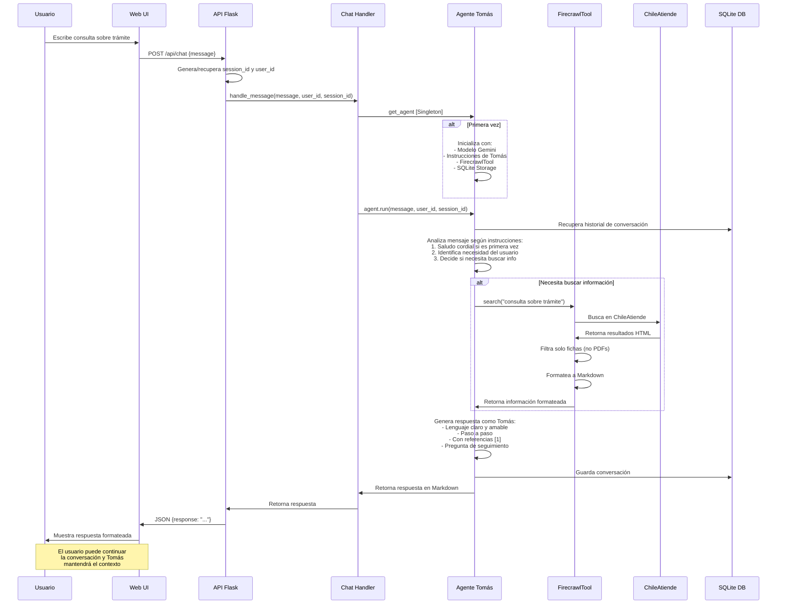

# Asistente de IA ChileAtiende

## Resumen y Objetivo Comercial

Este proyecto es un asistente de inteligencia artificial que ingiere, indexa y razona sobre toda la información pública del sitio web *chileatiende.gob.cl*. Su objetivo principal es proporcionar respuestas claras y concisas a las preguntas de los ciudadanos sobre los servicios gubernamentales, ahorrándoles un tiempo valioso, con un enfoque especial en ayudar a los adultos mayores.

El proyecto tiene como objetivo demostrar un flujo de trabajo donde un agente rastrea, estructura y actualiza continuamente el contenido de ChileAtiende, proporcionando respuestas fiables y respaldadas por citas en lenguaje natural.

## Demostración en video

LINK: <https://youtu.be/xKKGC60bA4g?si=DN_hUMciPLxKHAjz>

## Equipo del Proyecto

Este proyecto fue desarrollado por:

*   **Líder de Equipo**: `@estebanrucan` (Ingeniero Científico de Datos)
*   **Miembro del Equipo**: `@Constanza-Riquelme` (Analista de Datos)

*Hemos construido soluciones de aprendizaje automático para datos de bienes de consumo. Esteban diseña flujos de trabajo de ML de extremo a extremo en entornos de telecomunicaciones; Constanza analiza y modela conjuntos de datos FMCG de gran volumen para informar decisiones comerciales.*

## Características

*   **Asistente Conversacional Inteligente**: Interactúa con los usuarios en lenguaje natural para resolver consultas sobre trámites y servicios de ChileAtiende.
*   **Integración con Firecrawl**: Utiliza Firecrawl para realizar búsquedas en tiempo real en el sitio de ChileAtiende y extraer información relevante.
*   **Procesamiento con Modelos de Lenguaje (LLM)**: Emplea Gemini de Google para comprender consultas y generar respuestas coherentes y amigables para el usuario.
*   **Memoria Basada en Sesión**: El agente recuerda el contexto de la conversación durante la sesión actual del usuario para una interacción más fluida y personalizada.
*   **Interfaz Amigable para Adultos Mayores**: Diseño de frontend limpio con buena legibilidad y fácil navegación.
*   **Backend Flask**: Estructura modular y robusta utilizando Flask y Blueprints.

## Estructura del Proyecto

El proyecto sigue una estructura modular para facilitar el mantenimiento y la escalabilidad:

```
/chileatiende_assistant
├── app/                    # Módulo principal de la aplicación Flask
│   ├── __init__.py         # Fábrica de la aplicación Flask, registra Blueprints
│   ├── main/               # Blueprint para rutas de la UI (sirve index.html)
│   │   ├── __init__.py
│   │   └── routes.py
│   ├── api/                # Blueprint para la API de chat (/api/chat)
│   │   ├── __init__.py
│   │   └── routes.py
│   ├── agent_core/         # Lógica central para el agente Agno
│   │   ├── __init__.py
│   │   ├── agent_config.py # Configuración de herramientas e instrucciones del agente
│   │   ├── agent_setup.py  # Inicialización del Agente, Modelos, Almacenamiento
│   │   └── chat_handler.py # Lógica para manejar mensajes con el agente
│   ├── static/             # Archivos estáticos (CSS, JS)
│   │   ├── css/style.css
│   │   └── js/app.js
│   └── templates/          # Plantillas HTML (index.html)
├── data/                   # Directorio para bases de datos (ej., agent_sessions.db)
├── config.py               # Configuraciones de la aplicación Flask (claves, debug)
├── run.py                  # Script para ejecutar la aplicación (usado primariamente dentro de Docker)
├── .env                    # Archivo para variables de entorno (API Keys) - DEBES CREARLO
├── .env.example            # Ejemplo de variables de entorno
├── requirements.txt        # Dependencias del proyecto (usadas por Docker)
├── Dockerfile              # Define la imagen Docker para la aplicación
├── .dockerignore           # Especifica archivos a ignorar por Docker
├── docker-compose.yml      # Define servicios, redes y volúmenes para Docker
├── tests/                  # Directorio de pruebas
│   ├── __init__.py
│   ├── conftest.py         # Configuraciones comunes para pruebas (fixtures)
│   ├── test_agent_core.py  # Pruebas para el núcleo del agente
│   ├── test_api.py         # Pruebas para las rutas de la API
│   └── test_app.py         # Pruebas generales de la aplicación
└── README_es.md            # Este archivo
```

## Prerrequisitos

*   Docker Desktop (o Docker Engine + Docker Compose) instalado y en ejecución.
*   Un navegador web moderno.
*   Git (para clonar el repositorio).

## Configuración del Entorno

1.  **Clonar el Repositorio**:
    ```bash
    git clone <repository_url>
    cd chileatiende_assistant
    ```
    (Reemplaza `<repository_url>` con la URL real de tu repositorio Git)

2.  **Configurar Variables de Entorno**:
    En la raíz del proyecto, encontrarás un archivo llamado `.env.example`.
    Haz una copia de este archivo y llámala `.env`:

    *   En Windows (Símbolo del sistema o PowerShell):
        ```bash
        copy .env.example .env
        ```
    *   En macOS/Linux (Terminal):
        ```bash
        cp .env.example .env
        ```
    
    Ahora, abre el archivo `.env` y completa tus claves API reales y cualquier otra configuración necesaria:

    ```env
    FIRECRAWL_API_KEY="tu_clave_api_firecrawl_aqui"
    GOOGLE_API_KEY="tu_clave_api_google_gemini_aqui"
    SECRET_KEY="cambia_esto_por_una_cadena_secreta_muy_larga_y_segura"
    FLASK_DEBUG=True # Configura a False para un comportamiento similar a producción dentro de Docker
    ```
    Reemplaza los valores de ejemplo con tus credenciales reales y configuraciones deseadas. El archivo `.env` es crucial para que la aplicación se ejecute correctamente dentro de Docker y está incluido en `.dockerignore`, por lo que no se subirá al control de versiones.

## Ejecución de la Aplicación (con Docker)

Con Docker y Docker Compose instalados, y tu archivo `.env` configurado:

1.  **Construir y Ejecutar la Aplicación y Pruebas**:
    Abre tu terminal en el directorio raíz del proyecto (`chileatiende_assistant`) y ejecuta:
    ```bash
    docker-compose up --build
    ```
    Este comando ahora orquestará los servicios de la siguiente manera:
    *   Primero, construirá la imagen Docker para la aplicación (si es la primera vez o si `Dockerfile` o archivos relacionados cambiaron).
    *   Luego, iniciará el servicio `tests`. Este servicio ejecuta todas las pruebas del proyecto (ej., `pytest --cov=app`).
    *   **Si alguna prueba en el servicio `tests` falla, el proceso `docker-compose up` se detendrá y el servicio `app` no se iniciará.**
    *   Si todas las pruebas en el servicio `tests` pasan, este se completará exitosamente.
    *   Solo entonces se iniciará el servicio `app`. El servicio `app` mismo (usando `run.py`) *también* ejecutará las pruebas nuevamente como una verificación interna antes de lanzar el servidor de la aplicación Flask.

2.  **Acceder a la Aplicación**:
    Si todas las pruebas pasan y el servicio `app` se inicia, la aplicación Flask estará disponible en `http://127.0.0.1:5000/` o `http://localhost:5000/`.

3.  **Detener la Aplicación**:
    Para detener la aplicación, presiona `Ctrl+C` en la terminal donde se está ejecutando `docker-compose up`. Para eliminar los contenedores, puedes ejecutar `docker-compose down`.

## Pruebas (con Docker)

El proyecto está configurado para ejecutar pruebas de dos maneras principales con Docker:

1.  **Automáticamente durante el Inicio de la Aplicación**:
    Como se describe en la sección "Ejecución de la Aplicación", cuando ejecutas `docker-compose up`, el servicio `tests` se ejecuta primero. Si estas pruebas fallan, el servicio de la aplicación (`app`) no se iniciará. Si pasan, el servicio `app` luego también ejecutará las pruebas internamente a través de `run.py` antes de iniciar el servidor Flask.

2.  **Independientemente mediante un Comando de Prueba Dedicado**:
    Si deseas ejecutar las pruebas sin iniciar la aplicación completa, o para ver la salida de las pruebas más directamente:
    *   Asegúrate de que tu archivo `.env` esté configurado, ya que las pruebas podrían requerir claves API u otras variables de entorno.
    *   Abre tu terminal en la raíz del proyecto y ejecuta:
        ```bash
        docker-compose run --rm tests
        ```
    Este comando ejecuta específicamente el servicio `tests` definido en `docker-compose.yml`, el cual ejecuta `pytest --cov=app`. La bandera `--rm` asegura que el contenedor se elimine después de que las pruebas finalicen. Verás los resultados de las pruebas y el informe de cobertura en tu terminal.

Para generar y ver un informe de cobertura HTML:

1.  Primero, asegúrate de que el directorio `htmlcov` pueda ser escrito por el contenedor de Docker o ajusta los montajes de volumen si es necesario. Para simplificar, puedes ejecutar pytest fuera de Docker si tienes un entorno Python local configurado, o ingresando al contenedor `app` en ejecución:
    ```bash
    # Si la app se está ejecutando mediante docker-compose up -d
    docker-compose exec app pytest --cov=app --cov-report=html
    # Luego, el directorio htmlcov estará dentro de /usr/src/app del contenedor.
    # Es posible que necesites copiarlo: docker cp <id_contenedor>:/usr/src/app/htmlcov ./htmlcov
    ```
    Alternativamente, para CI/CD, la salida en terminal de `pytest --cov=app` suele ser suficiente.

## Funcionamiento Interno

*   **Interfaz de Usuario (`index.html`, `style.css`, `app.js`)**: Proporciona una ventana de chat simple y accesible. Las preguntas del usuario se envían al backend mediante JavaScript (`API fetch`).
*   **Backend (Flask)**:
    *   `run.py` inicia la aplicación Flask utilizando la fábrica `create_app` definida en `app/__init__.py`.
    *   `app/__init__.py` configura la aplicación, carga los ajustes desde `config.py` y registra los Blueprints.
    *   `app/main/routes.py` sirve la página principal (`index.html`).
    *   `app/api/routes.py` maneja las solicitudes a `/api/chat`. Genera/recupera un `user_id` y `session_id` para el usuario (usando la sesión de Flask) y pasa la consulta al `chat_handler`.
*   **Núcleo del Agente (`app/agent_core/`)**:
    *   `agent_config.py`: Contiene plantillas de prompts, configuración de `FirecrawlTool`.
    *   `agent_setup.py`: Inicializa el modelo LLM (Gemini), la instancia de `FirecrawlTool`, el almacenamiento de sesión (`SqliteStorage` en el directorio `data/`) y el `Agent` de Agno. Este agente se configura con herramientas, instrucciones y el sistema de almacenamiento para el historial.
    *   `chat_handler.py`: La función `handle_message` recibe la pregunta del usuario y los IDs de sesión/usuario, invoca al agente (`agent.run`) y devuelve la respuesta generada.
*   **Memoria y Estado**: Se utiliza `SqliteStorage` para mantener un historial de conversación por sesión (`user_id`, `session_id`), permitiendo que el agente tenga contexto de interacciones previas dentro de la misma sesión.

## Tecnologías Utilizadas

*   **Python**: Lenguaje de programación principal.
*   **Flask**: Microframework web para el backend.
*   **Agno**: Framework para crear agentes de IA.
*   **SDK de Firecrawl**: Para interactuar con el servicio Firecrawl y realizar búsquedas web.
*   **Google Gemini**: Modelo de lenguaje grande para procesamiento de lenguaje natural.
*   **HTML, CSS, JavaScript**: Para la interfaz de usuario del chat.
*   **SQLite**: Para el almacenamiento de sesiones del agente.
*   **python-dotenv**: Para gestionar variables de entorno.
*   **pytest**: Para la ejecución de pruebas.
*   **Coverage.py**: Para medir la cobertura de código de las pruebas.
*   **Docker & Docker Compose**: Para la contenedorización y simplificación del despliegue/desarrollo.

## Arquitectura y Flujo del Agente

Esta sección describe la arquitectura del Asistente de IA ChileAtiende y el flujo típico de interacción del usuario.

### Arquitectura General

El siguiente diagrama ilustra los componentes principales de la aplicación y cómo están organizados en capas:

```mermaid
graph LR
    subgraph "1. Capa de Presentación"
        User[Usuario] -->|Envía mensaje| UI[index.html]
        UI -->|POST /api/chat| APIEndpoint[API Endpoint]
    end

    subgraph "2. Capa de API (Flask)"
        APIEndpoint -->|Valida request| APIRoutes[app/api/routes.py]
        APIRoutes -->|Extrae mensaje, user_id, session_id| SessionManager[Gestión de Sesión]
        SessionManager -->|Llama a| ChatHandler[chat_handler.py]
    end

    subgraph "3. Capa de Lógica del Agente"
        ChatHandler -->|get_agent| AgentSetup[agent_setup.py]
        
        subgraph "Inicialización del Agente"
            AgentSetup -->|Lee configuración| Config[config.py]
            Config -->|API Keys| Keys[Google API Key<br/>Firecrawl API Key]
            
            AgentSetup -->|Crea| Components{Componentes del Agente}
            Components -->|1| GeminiModel[Modelo Gemini<br/>gemini-2.0-flash]
            Components -->|2| SqliteDB[SqliteStorage<br/>agent_sessions.db]
            Components -->|3| FirecrawlTool[FirecrawlTool]
            Components -->|4| Instructions[AGENT_INSTRUCTIONS<br/>Persona: Tomás]
        end

        subgraph "Ejecución del Agente"
            AgentSetup -->|Retorna| AgentInstance[Instancia Agno Agent]
            ChatHandler -->|agent.run| AgentInstance
            AgentInstance -->|Procesa con| AgentLogic{Lógica del Agente}
            
            AgentLogic -->|Usa historial| SqliteDB
            AgentLogic -->|Usa modelo| GeminiModel
            AgentLogic -->|Sigue instrucciones| Instructions
            AgentLogic -->|Si necesita buscar| FirecrawlExec[Ejecuta FirecrawlTool]
        end
    end

    subgraph "4. Capa de Herramientas Externas"
        FirecrawlExec -->|search| FirecrawlAPI[FirecrawlApp API]
        FirecrawlAPI -->|Busca en| ChileAtiende[www.chileatiende.gob.cl]
        ChileAtiende -->|Resultados HTML| FirecrawlAPI
        FirecrawlAPI -->|Filtra fichas, excluye PDFs| FilteredResults[Resultados Filtrados]
        FilteredResults -->|Formatea con template| MarkdownResult[Resultado en Markdown]
    end

    subgraph "5. Flujo de Respuesta"
        MarkdownResult -->|Retorna a| AgentLogic
        AgentLogic -->|Genera respuesta final| FinalResponse[Respuesta en Markdown<br/>con formato de Tomás]
        FinalResponse -->|Retorna a| ChatHandler
        ChatHandler -->|Retorna a| APIRoutes
        APIRoutes -->|JSON Response| UI
        UI -->|Muestra respuesta| User
    end
```



### Flujo de Interacción (Agente Tomás)

Este diagrama de secuencia muestra el flujo de interacción típico cuando un usuario realiza una consulta:



## Posibles Mejoras Futuras

*   Añadir más herramientas al agente (ej., consulta de otras bases de datos).
*   Implementar un panel de administración para monitorizar interacciones.
*   Desarrollar pruebas unitarias y de integración más completas. 
